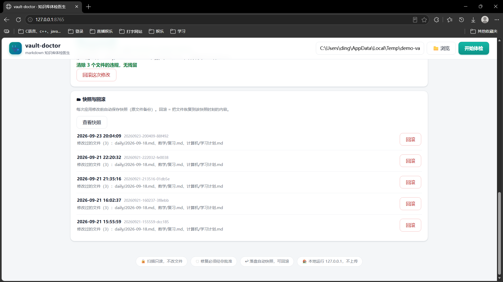
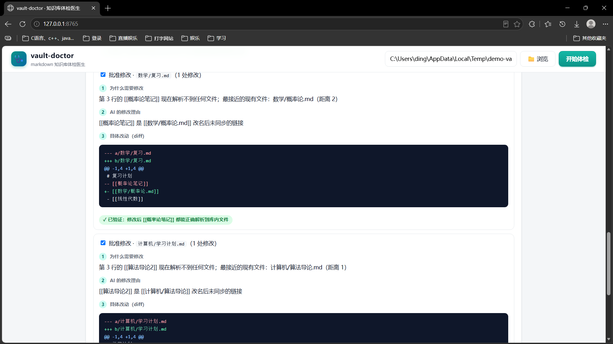
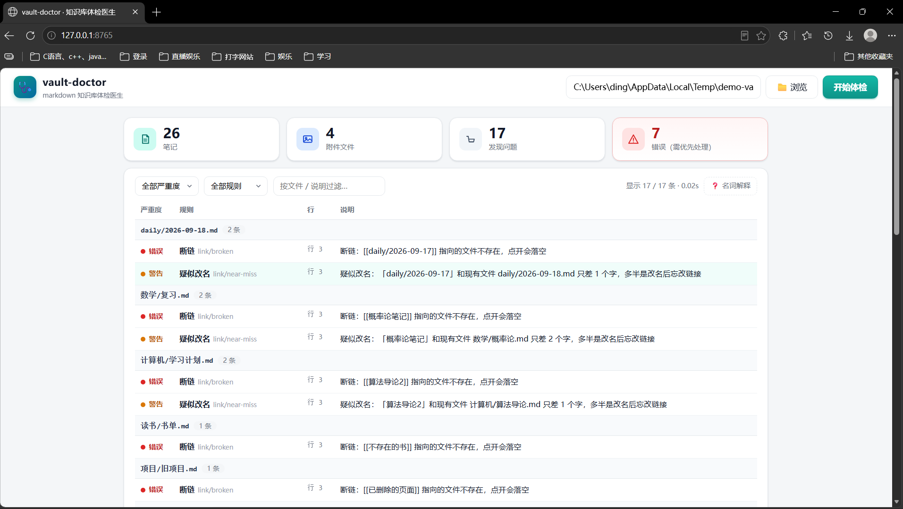

# vault-doctor 🩺

[](https://github.com/Ding-tx/vault-doctor/actions/workflows/ci.yml)
[](https://www.python.org/)
[](LICENSE)

**The doctor for your markdown knowledge base** — graph-aware lint that finds broken links, orphan notes and unreferenced attachments, and tells you when a "broken" link is really just a renamed file.

**markdown 知识库的体检医生** —— 图谱语义层的 lint：找出断链、孤儿笔记、未被引用的附件，并告诉你哪些"断链"其实只是文件改了名。

<p align="center">
  
</p>

```text
$ vault-doctor scan .
669 篇笔记 · 175 个附件 · 索引耗时 0.65s
error  link/broken         数学/复习.md:4       断链：[[概率论笔记]] 指向的文件不存在，点开会落空
warn   link/near-miss      数学/复习.md:4       疑似改名：「概率论笔记」和现有文件 数学/概率论.md 只差 2 个字，多半是改名后忘改链接
warn   note/orphan         misc/ideas.md        孤儿笔记：没有任何笔记链接它，它也没链接别人
warn   asset/unreferenced  assets/old.png       未引用附件：没有任何笔记引用它
共 17 条：7 error · 10 warn · 0 info
```

## Why / 为什么需要它

lychee checks **external** URLs. markdownlint fixes **formatting**. Obsidian plugins are editor-locked and detect-only. vault-doctor covers the missing layer: it understands the **graph** of your vault — `[[wikilinks]]`, backlinks, orphans — works on **any** markdown folder (Obsidian / Typora / VS Code / plain git repos), and its near-miss engine maps broken links to renamed files (Damerau-Levenshtein ≤ 2, filtered by name-length ratio and file extension).

它来自我自己的笔记库：Typora + git 管了几年，几百篇攒下来，文件一改名、一挪位置，笔记里的链接就悄悄烂掉，而 lychee 只查外部网址，Obsidian 插件又离不开编辑器。vault-doctor 补的就是这一层——它**懂你知识库的图谱**：wikilink、反向链接、孤儿，任何 markdown 文件夹都能用；near-miss 引擎还能把断链映射到改名后的文件（Damerau-Levenshtein ≤ 2，按名称长度比和扩展名过滤误报）。

## Install / 安装

Requires Python ≥ 3.12.

```bash
pipx install vault-doctor     # TODO: PyPI 发布后可用
# 或从源码（开发）
pip install -e .
```

## Usage / 用法

```bash
vault-doctor scan <vault-path>             # 扫描（默认只读，绝不修改任何文件）
vault-doctor scan . --format json          # JSON 输出（CI / 工具链集成）
vault-doctor scan . --format sarif -o out.sarif   # SARIF 2.1.0（GitHub Code Scanning）
vault-doctor scan . --rules note/orphan    # 只跑指定规则
vault-doctor rules                         # 列出内置 + 插件规则
vault-doctor why . --index 1               # 用 LLM 把一条违规翻译成人话
vault-doctor fix .                         # agent 修复：起草 → diff 预览 → 你确认 → 快照 → 应用 → 复扫验证
vault-doctor snapshots .                   # 查看修复快照
vault-doctor rollback <sid> .              # 回滚一次修复会话
vault-doctor ui .                          # 本地图形界面（浏览器打开，仅本机可访问）
vault-doctor mcp .                         # 只读 MCP server（stdio，供 Claude Code / Cursor 调用）
```

**Web UI**：`vault-doctor ui <vault>` 启动本地图形界面，只绑 127.0.0.1，不新增任何依赖。体检报告、违规详情、修复卡片、快照回滚都在页面上——长这样：

<p align="center">
  
</p>
<p align="center">
  
</p>

**AI 功能需要 API key**（`why` / `fix` / Web UI 里的 AI 按钮，任何 OpenAI 兼容端点都行）。

最快的配法：打开 Web UI 的“模型与 API key”卡片，选厂商（智谱、DeepSeek、Kimi、通义千问、豆包、MiniMax、硅基流动、OpenAI 都有预设，也可以自定义），贴上 key，点“测试连接”确认能通，再保存。key 写进本机的 `config.local.toml`——这个文件在 gitignore 里，不会进仓库；页面上也只显示打码后的几位。

不想用界面配的话：复制 `config.example.toml` 改名 `config.local.toml` 手填，或直接用环境变量 `VAULT_DOCTOR_API_KEY`（可选 `VAULT_DOCTOR_BASE_URL` / `VAULT_DOCTOR_MODEL`）。

**Exit codes / 退出码**（CI 友好）：`0` 干净 · `1` 存在 error 级违规 · `2` 用法/路径错误。

**`.vaultdoctorignore`**（放库根，每行一个 fnmatch 模式，`#` 为注释）——把供应商代码等"非笔记子树"划出扫描范围：

```text
# 每行一个模式，匹配路径前缀即整棵跳过
vendor/
Grok/grok-build-main
```

## MCP server（让 Claude Code / Cursor 读懂你的知识库）

安装可选依赖后，`vault-doctor mcp` 变成一个**只读 MCP server**（stdio）——任何支持 MCP 的 agent 都能直接查询你知识库的图谱：

```bash
pip install "vault-doctor[mcp]"     # 可选依赖，不装不影响其余功能
vault-doctor mcp D:\notes           # stdio server，由 MCP 客户端拉起
```

在 Claude Desktop / Claude Code / Cursor 的 MCP 配置中加一行：

```json
{
  "mcpServers": {
    "vault-doctor": { "command": "vault-doctor", "args": ["mcp", "D:\\notes"] }
  }
}
```

暴露五个只读工具：`scan_vault`（全库体检）、`outgoing_links` / `backlinks`（链接关系）、`near_miss_candidates`（改名候选）、`search_notes`（全文检索，支持中文子串）。没有写工具，改文件只能走 `fix` 命令的人工闸门。

## Rules / 内置规则

| 规则 | 严重度 | 说明 |
|---|---|---|
| `link/broken` | error | 链接指向的文件不存在，点开会落空；能识别 `[[wikilink]]`、`[md](相对路径)` 与 `.\images\x.png` 这类 Windows 写法 |
| `link/near-miss` | warn | 断链目标和某个现有文件名只差一两个字——改名/笔误的链接，给出最像的候选（`fix` 可自动修复） |
| `note/orphan` | warn | 没有任何笔记链接它、它也不链接别人的笔记 |
| `asset/unreferenced` | warn | 没有任何笔记引用的图片 / PDF 等附件 |

## Plugins / 插件规则

任何 pip 包都能给 vault-doctor 加规则——在自己的 `pyproject.toml` 里声明：

```toml
[project.entry-points."vault_doctor.rules"]
my_rule = "my_package.rules:MY_RULE"   # 指向 Rule 实例或 Rule 序列
```

安装后 `vault-doctor rules` 即可看到（来源列标"插件"）。规则 id 与内置冲突时内置优先；坏插件跳过并告警，不拖垮扫描。

## GitHub Action / CI

```yaml
- uses: Ding-tx/vault-doctor@v0.4.0
  with: { path: docs/ }
```

在 PR 上直接标注断链（SARIF → GitHub Code Scanning）。也可只用 CLI 接入自有流水线：`vault-doctor scan . --format sarif -o out.sarif`，退出码 `1` 即存在 error 级违规。

**Safety / 安全**：`scan` 和 `rules` 永远只读。`fix` 每次写入前都要过 diff 预览和逐文件确认（y/n/a/q，随时 q 全取消），写入前自动快照，写完复扫验证；不满意就 `rollback` 还原。全程留痕在 `.vaultdoctor/transcripts/`——每次 LLM 调用的 token、你在闸门按的每个键都在里面，另有会话级 token 预算熔断。

## How it works / 工作原理

- **SQLite 单文件索引**：`(mtime, size)` 指纹增量更新；FTS5 trigram 分词支持中文全文检索；链接图两级可见性（解析器看得见一切路径，规则各管各的域）
- **解析器带版本号**：引擎解析逻辑升级后自动全量重解析链接，不依赖文件变动（增量索引的版本失效机制）
- 代码块与行内代码中的"链接"不计入；隐藏目录、`__pycache__` 等自动跳过

## Roadmap / 路线图

- **已有**：规则插件 SDK、SARIF + GitHub Action、`why` 解释、agent 修复循环（fix / rollback / 会话转录 / token 熔断）、只读 MCP server、Web UI
- **想做**：本地 embedding 语义查重、模型路由、外部 URL 检查（与 lychee 配合）、会话重放、插件注册表

## Comparison / 对比

| | vault-doctor | lychee | markdownlint | Obsidian 插件 |
|---|---|---|---|---|
| 外部 URL 检查 | ✗（计划中，与 lychee 配合） | ✓ | ✗ | 部分 |
| 格式修复 | ✗（互补，交给它） | ✗ | ✓ `--fix` | ✓ |
| wikilink 图谱解析 | ✓ | ✗ | ✗ | ✓（锁编辑器） |
| 孤儿 / 未引用附件 | ✓ | ✗ | ✗ | 部分 |
| near-miss 改名检测 | ✓ | ✗ | ✗ | ✗ |
| 独立 CLI / 任意编辑器 | ✓ | ✓ | ✓ | ✗ |
| Windows 反斜杠路径归一 | ✓ | ✗ | ✗ | — |

## Development / 开发

```bash
pip install -e .
pip install pytest
pytest -v
```

113 项测试每次推送都在 GitHub Actions 上双平台（Ubuntu + Windows）全量跑。

## License

[MIT](LICENSE)
